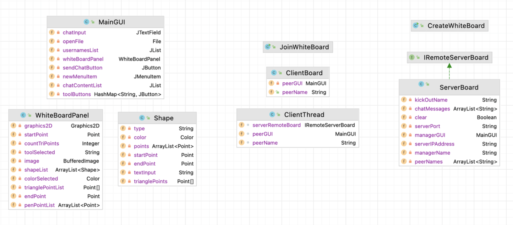
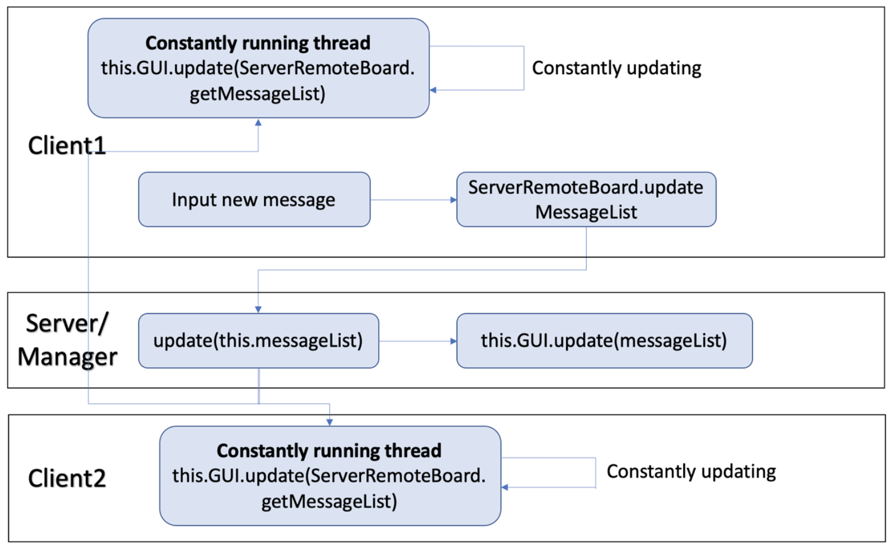

# Shared Whiteboard Project

## Project Overview
This project implements a distributed shared whiteboard application with collaborative features for multiple users. Key functionalities include synchronized drawing, user management by a "manager" (such as removing users from the room), a chat box, and file management (e.g., saving work). The main technologies used are **Java Swing** for the user interface and **Java RMI** for client-server communication.

## Features
- **Whiteboard Tools**: Includes tools for drawing shapes (pen, circle, triangle, rectangle) and text, with a color selector for customization.
- **Multi-User Collaboration**: Synchronized whiteboard for all users, with real-time updates.
- **Manager Controls**: The manager can remove users, create/save whiteboard files (in PNG format), and manage user permissions.
- **Chat Box**: Real-time chat for all users in the session.

## System Design
The core components of the system include:
- **CreateWhiteBoard**: Acts as the server, creating the whiteboard and allowing connections.
- **JoinWhiteBoard**: Allows clients to join an existing whiteboard and syncs with the server.
- **WhiteBoard Panel**: Manages drawing and synchronization across all clients.

### UML Diagram

## Communication Protocol
Communication is implemented using **Java RMI**. The server registers the "WhiteBoard" remote object, which clients locate and connect to for synchronous updates. Below is an example of message flow:

1. **Client Action**: When a client sends a message or draws, it triggers an update in the server's whiteboard state.
2. **Server Update**: The server updates its state and notifies all connected clients.
3. **Client Sync**: Each client continuously syncs with the server to display the latest board and chat state.

### Client-Server Communication Diagram

## Implementation Details
- **GUI Components**: Tool selector, color chooser, file management options, and chat box.
- **Data Format**: 
  - Messages are sent as simple strings.
  - Whiteboard drawings are serialized into byte arrays for synchronization.
  - Files are saved in PNG format to maintain compatibility and quality.

## Known Issues
- **Resolution Loss**: The whiteboard image quality may degrade over time as more strokes are added, potentially due to data type choices.
- **Thread Efficiency**: Current implementation updates constantly, which may be optimized by adding a status flag to check for changes before updating.

## Getting Started
1. **Server Setup**: Run `CreateWhiteBoard` to initialize the server.
2. **Client Setup**: Run `JoinWhiteBoard` to connect as a client.

## License
This project is not licensed for distribution or modification. University students are permitted to reference this repository for educational purposes only. Copying or reproducing any part of this project without proper attribution may lead to serious plagiarism issues and academic consequences. Please ensure that any use of this material complies with your institution's academic integrity policies.